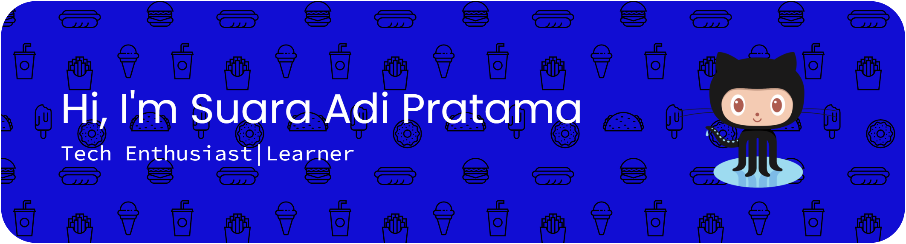

## Hi there, I'm Suara Adi Pratama👋

<!--
**suaraA7/suaraA7** is a ✨ _special_ ✨ repository because its `README.md` (this file) appears on your GitHub profile.

Here are some ideas to get you started:

- 🔭 I’m currently working on ...
- 🌱 I’m currently learning ...
- 👯 I’m looking to collaborate on ...
- 🤔 I’m looking for help with ...
- 💬 Ask me about ...
- 📫 How to reach me: ...
- 😄 Pronouns: ...
- ⚡ Fun fact: ...
-->

🌱 I'm **a Tech Enthusiast**, especially in **Web Development** and now, i'm **interested** in **Software Quality Assurance (Manual Testing)**.

#### My Skills

